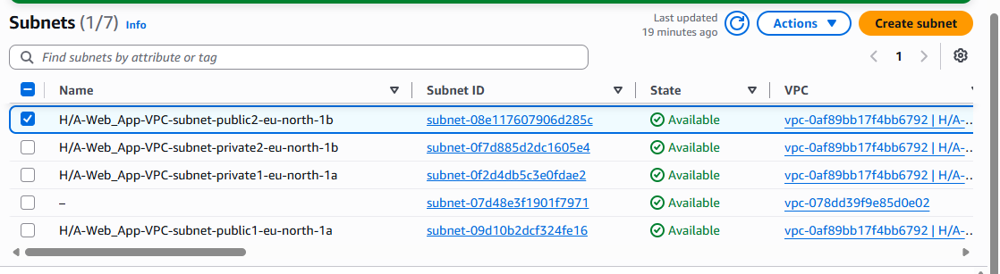
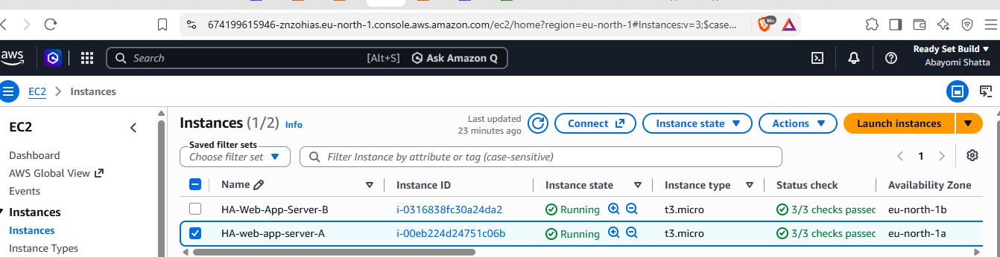
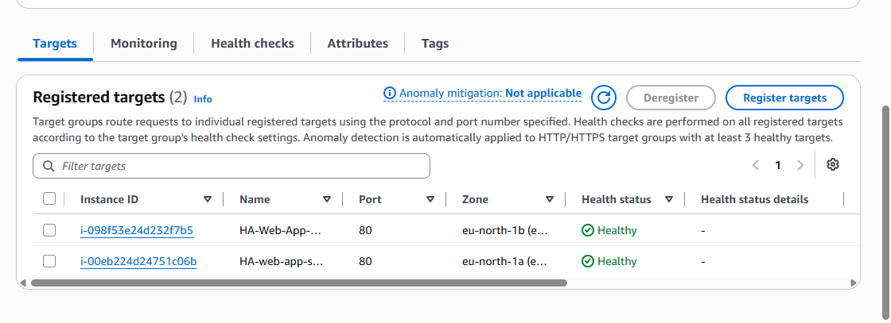
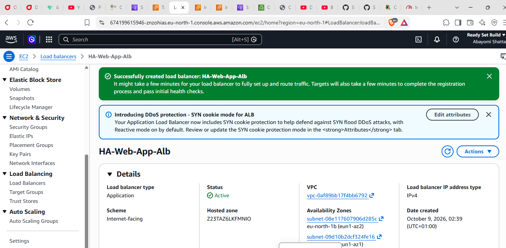
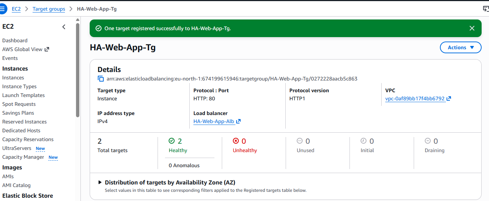
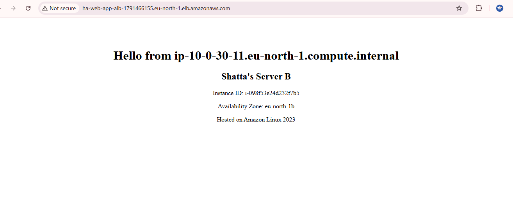
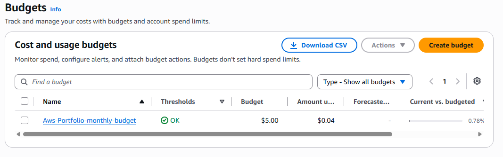

# AWS-High-Availability-Web-App
Building a highly available web application with services such as; EC2, VPC, Load balancer, Auto Scaling, IAM, and CloudWatch

Highly Available Web Application on AWS

Project Overview

This project demonstrates the deployment of a highly available web application on Amazon Web Services (AWS) using an Application Load Balancer (ALB) and two Amazon EC2 web servers deployed across separate Availability Zones.

The project focuses on core AWS infrastructure skills, including VPC design, subnet configuration, EC2 provisioning, security groups, load balancing, target group health checks, troubleshooting, and cost management.

The application was tested through the Application Load Balancer DNS endpoint, and both EC2 instances were confirmed healthy in the target group.

Project Objectives

- Build a custom AWS virtual network.
- Deploy EC2 web servers across two Availability Zones.
- Configure an internet-facing Application Load Balancer.
- Distribute HTTP requests between healthy web servers.
- Restrict direct web access to the EC2 instances using security groups.
- Troubleshoot failed health checks and internet connectivity.
- Document the infrastructure and testing evidence.

Architecture

Request Flow

Internet → Application Load Balancer → Target Group → EC2 Server 1 / EC2 Server 2

The Application Load Balancer receives incoming HTTP requests and forwards them to registered, healthy EC2 instances. Deploying the servers across separate Availability Zones helps reduce dependence on a single zone.

Architecture Components

Component| Purpose
Amazon VPC| Provides an isolated virtual network
Public subnets| Host the internet-facing ALB and, in this learning deployment, the EC2 servers
Private subnets| Provide network segmentation for future private resources
Internet Gateway| Enables internet connectivity when routing and addressing are configured correctly
Amazon EC2| Runs the web application
Application Load Balancer| Distributes incoming requests
Target Group| Registers the EC2 instances and monitors their health
Security Groups| Control inbound and outbound traffic
Amazon Linux 2023| Operating system for the web servers
Apache HTTP Server| Serves the application webpages
AWS Budgets| Helps monitor project spending

# 1. VPC and Network Design

The project uses a custom VPC with the IPv4 CIDR block "10.0.0.0/16" in the "eu-north-1" (Europe/Stockholm) AWS region.

The VPC was configured with four subnets distributed across two Availability Zones:

- Two public subnets.
- Two private subnets.
- An Internet Gateway.
- Route tables for controlling network traffic.

The public subnets provide the network placement for the internet-facing Application Load Balancer. The EC2 instances were deployed in separate public subnets for this learning project to enable outbound package downloads without a NAT Gateway.

### VPC and Subnet Configuration

Figure 1: VPC subnet layout showing the public and private network segments.

Network Design Considerations

- The VPC uses a local route for communication within its CIDR range.
- The public subnet route tables use a default route to the Internet Gateway.
- Internet access also requires appropriate addressing and security configuration.
- Private subnets were created but are not currently hosting the web servers.

Production improvement: A production architecture would normally place application servers in private subnets and provide controlled outbound connectivity where required.

# 2. EC2 Web Server Deployment

Two Amazon EC2 instances were deployed using Amazon Linux 2023. Each instance hosts a simple HTML webpage served by Apache.

The instances were placed in separate Availability Zones:

- Server 1: "eu-north-1a"
- Server 2: "eu-north-1b"

Each server displays a different message to make it possible to observe which instance responds to requests through the load balancer.

Web Server Setup

The instances were configured with EC2 user data to automate the initial installation and setup of Apache.

Example user data for Server 1:

#!/bin/bash

#Update and install Apache
yum install httpd -y
systemctl start httpd
systemctl enable httpd

#Create the landing page
cat > /var/www/html/index.html <<'EOF'
<!DOCTYPE html>
<html>
<head>
    <title>Highly Available Web App</title>
</head>
<body style="font-family: Times, serif; text-align: center; padding: 50px;">
    <h1>Hello from $HOSTNAME</h1>
    <h2>Shatta's Server A</h2>
    
Hosted on Amazon Linux 2023

</body>
</html>
EOF

Server 2 uses a different user data setup, with the page heading changed.
#!/bin/bash

yum update -y
yum install -y httpd
systemctl start httpd
systemctl enable httpd

#Get instance metadata (needs IMDSv2 token)
TOKEN=$(curl -s -X PUT "http://169.254.169.254/latest/api/token" \
    -H "X-aws-ec2-metadata-token-ttl-seconds: 21600")

AZ=$(curl -s -H "X-aws-ec2-metadata-token: $TOKEN" \
    http://169.254.169.254/latest/meta-data/placement/availability-zone)

INSTANCE_ID=$(curl -s -H "X-aws-ec2-metadata-token: $TOKEN" \
    http://169.254.169.254/latest/meta-data/instance-id)

HOSTNAME=$(hostname)

cat > /var/www/html/index.html <<EOF
<!DOCTYPE html>
<html>
<head>
    <title>Highly Available Web App</title>
</head>
<body style="font-family: Times, serif; text-align: center; padding: 50px;">
    <h1>Hello from $HOSTNAME</h1>
    
Instance ID: $INSTANCE_ID

    
Availability Zone: $AZ

    
Hosted on Amazon Linux 2023

</body>
</html>
EOF

### EC2 Instance Evidence

Figure 2: The two EC2 instances deployed across separate Availability Zones.

# 3. Security Group Configuration

Separate security groups were created for the Application Load Balancer and the EC2 instances.

Application Load Balancer Security Group

Security group: "ha-web-app-alb-sg"

Inbound rule:

Type| Protocol| Port| Source
HTTP| TCP| 80| "0.0.0.0/0"

This permits internet clients to access the application through the ALB over HTTP.

EC2 Security Group

Security group: "ha-web-app-ec2-sg"

Inbound rule:

Type| Protocol| Port| Source
HTTP| TCP| 80| ALB security group "ha-web-app-alb-sg"

The EC2 instances accept HTTP traffic from the load balancer's security group rather than directly from the internet. SSH access was not opened to the internet.

This design encourages application traffic to pass through the ALB.

Security improvement: The project uses HTTP for demonstration purposes. A production deployment should use HTTPS, an appropriate TLS certificate, restricted administrative access, and additional security controls.

# 4. Target Group Configuration

The target group connects the Application Load Balancer to the EC2 web servers.

Target group: "ha-web-app-tg"

Configuration:

- Target type: Instances
- Protocol: HTTP
- Port: 80
- Health check protocol: HTTP
- Health check path: "/"
- Registered targets: Two EC2 instances

The target group checks whether each web server can respond successfully to health-check requests.

Target Group Evidence

Figure 3: Target group configuration used to route requests to the EC2 instances.

# 5. Application Load Balancer

An internet-facing Application Load Balancer named "ha-web-app-alb" was deployed across the two public subnets.

Configuration:

- Scheme: Internet-facing
- IP address type: IPv4
- Listener: HTTP on port 80
- Default action: Forward requests to "ha-web-app-tg"
- Availability Zones: "eu-north-1a" and "eu-north-1b"

The ALB provides a single DNS endpoint through which clients access the application.

ALB Configuration Evidence

Figure 4: Application Load Balancer configuration.

# 6. Health Checks and Validation

The target group uses health checks to determine whether the registered web servers can serve the application.

During final testing, both EC2 instances were registered and reported a Healthy status.

Target Health Evidence

Figure 5: Both EC2 instances reporting healthy status in the target group.

Why Health Checks Matter

An EC2 instance can be running and passing its EC2 status checks while the web application inside it is unavailable. The load balancer's health checks help detect this difference and direct traffic only to targets considered healthy.

# 7. Application Testing

The application was accessed using the DNS name of the Application Load Balancer.

The two servers display different page headings:

- "Hello from EC2 Server 1!"
- "Hello from EC2 Server 2!"

Refreshing the ALB endpoint allowed the responses from the two instances to be observed.

Server 1 Response

Figure 6: Application response received through the ALB endpoint.

Server 2 Response

Figure 7: Another application response observed through the ALB endpoint.

The ALB distributes requests across healthy targets, but responses are not guaranteed to alternate on every refresh. Client connections and load-balancing behavior can affect which server responds.

# 8. Troubleshooting Experience

One of the most important learning experiences in this project was troubleshooting repeated health-check failures on the second EC2 instance.

The Problem

The second EC2 instance was running and passing its EC2 status checks, but the target group reported health-check failures.

The system log also showed package repository download timeouts while attempting to retrieve Amazon Linux repository metadata.

Investigation

The following checks were performed:

1. Confirmed that the EC2 instance was running and its status checks passed.
2. Verified that the public subnet's route table contained a default route to the Internet Gateway.
3. Checked the instance's public IPv4 address.
4. Found that the instance did not have a public IPv4 address.
5. Discovered that automatic public IPv4 assignment was disabled on the subnet.

Resolution

The subnet's auto-assign public IPv4 setting was enabled. Since changing this setting does not automatically assign an address to an existing instance, the original instance was terminated and a replacement was launched with public IPv4 assignment enabled.

The replacement instance was then registered in the target group. Both instances subsequently reported healthy status.

Key Lessons Learned

- EC2 status checks and ALB target health checks measure different things.
- A route to an Internet Gateway alone does not guarantee internet connectivity.
- An instance in a public subnet needs suitable public addressing, routing, and security configuration for direct internet access.
- EC2 user data can automate web server installation and deployment.
- Target group health checks are essential for reliable traffic distribution.
- Troubleshooting should proceed methodically, checking logs, routes, addresses, and security configuration.

9. Cost Management

AWS infrastructure can incur charges while resources are deployed, even when the website receives little or no traffic.

The principal cost considerations for this project include:

- Application Load Balancer usage.
- Running EC2 instances.
- Public IPv4 addresses.
- EBS volumes and other retained resources, where applicable.

An AWS Budget was configured to help monitor spending.

AWS Budget Evidence

Figure 8: AWS Budget used to monitor cloud spending.

Cost-Control Practices

- Monitor the AWS billing dashboard and budget alerts.
- Avoid creating a NAT Gateway unless the architecture requires it.
- Remove or stop using billable resources after testing and documentation are complete.
- Review the selected region's current pricing.
- Remember that stopping EC2 instances does not stop all possible charges; the ALB and retained resources may continue to incur costs.

# 10. Deployment Workflow Summary

The deployment was completed in the following order:

1. Created the VPC and four subnets.
2. Configured the Internet Gateway and subnet routing.
3. Created the ALB and EC2 security groups.
4. Created the target group and configured health checks.
5. Launched the first EC2 instance and installed Apache.
6. Created the Application Load Balancer and configured its listener.
7. Registered Server 1 and confirmed it was healthy.
8. Launched Server 2 in the second Availability Zone.
9. Investigated and corrected the second server's public IPv4 configuration.
10. Registered Server 2 in the target group.
11. Confirmed that both targets were healthy.
12. Tested the web application through the ALB DNS endpoint.
13. Captured screenshots and documented the implementation.

# 11. Skills Demonstrated

This project demonstrates practical exposure to:

- AWS VPC and subnet design.
- IPv4 addressing and route tables.
- Internet Gateway configuration.
- EC2 instance provisioning.
- Linux web server deployment.
- EC2 user data automation.
- Application Load Balancer configuration.
- Target group registration and health checks.
- Security group configuration and traffic restriction.
- Multi-AZ architecture concepts.
- Troubleshooting network connectivity and service availability.
- AWS cost monitoring.
- Technical documentation using GitHub.

# 12. Future Improvements

The following improvements would move the project closer to a production-grade architecture:

- Auto Scaling Group: Automatically replace unhealthy instances and adjust capacity based on demand.
- Private application subnets: Move the EC2 instances into private subnets with an appropriate egress design.
- HTTPS: Configure TLS using AWS Certificate Manager and an appropriate listener.
- CloudWatch: Add monitoring, metrics, and alarms.
- Infrastructure as Code: Rebuild the infrastructure using AWS CloudFormation or Terraform.
- Improved deployment automation: Use a repeatable deployment process for web server configuration.
- Resilience testing: Test how the ALB behaves when one target becomes unhealthy.

### Disclaimer

This project was built by Shatta A.A for hands-on AWS learning and portfolio development. It demonstrates multi-AZ EC2 deployment and load balancing, but it does not yet implement every production-grade feature, including HTTPS, an Auto Scaling Group, and private-subnet application hosting.
